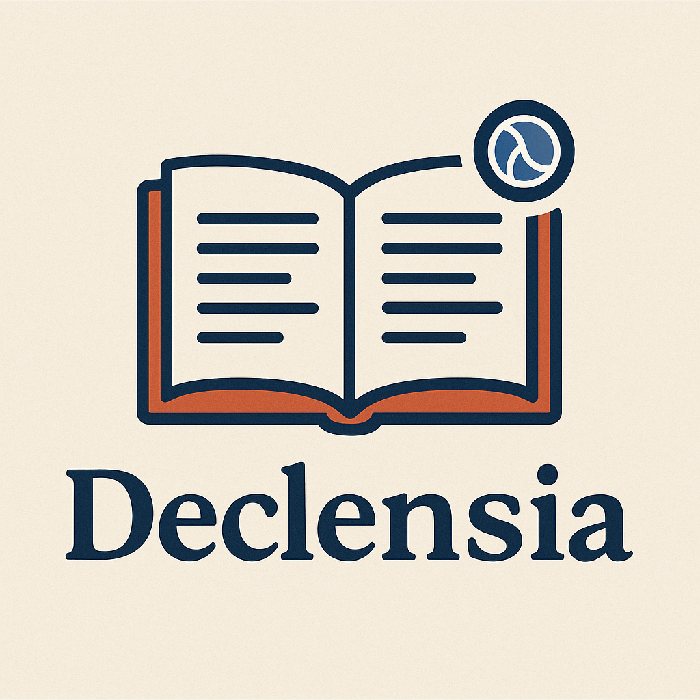

# Declensia



## A library for pluralizing and singularizing

The api is small. 
- `declensia.core/pluralize` changes a singular to a plural.
- `declensia.core/singularize` changes a plural to a singular

For now, there are no guarantees about what happens when you pass a singular word to `singularize`; same for `pluralize`.

## Extensibility

Everything is meant to be extensible, and there's a few options based on your needs. 

### Direct
To make a direct change for a single word, you can define a new multimethod on `singularize` and `pluralize`, both of which dispatch on `identity`. 

```clj
  (defmethod pluralize   "foobaria" [_] "foobar")
  (defmethod singularize "foobar"   [_] "foobaria")
```
### Adding Rules
New rules can be added with `add-rule`.  These new rules take precedent over existing rules (based on rule type). 

There are 3 types of rules, `:uncountable` `:irregular` and `:regular`.

These are named for how they are intended to be used, but only programmatic
difference is that `:uncountable` rules are considered first, `:irregular`
second, and `:regular` last. There are some warnings printed if you try to use
something other than one of these in the call to `add-rule`.

Here are some examples 

```clj
(add-rule :plural   :irregular (rule "ox"     "oxen"))
(add-rule :singular :irregular (rule "oxen"   "ox"))
(add-rule :plural   :irregular (rule "person" "people"))
(add-rule :singular :irregular (rule "people" "person"))
```

